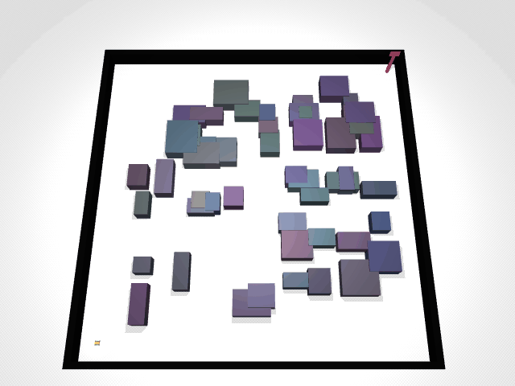

## Visualizing Path Planning Algorithms in MuJoCo

| **RRT** | **RRT*** |
| :---: | :---: |
|  |  |
| **Rapidly-exploring Random Tree** | **Optimal RRT** |

| **RRT-Connect** | **Informed RRT*** |
| :---: | :---: |
|  |  |
| **Bi-directional Search** | **Focused Search with Ellipsoid** |

| **PRM** | **EST** |
| :---: | :---: |
|  |  |
| **Probabilistic Roadmap** | **Expansive Space Trees** |

| **FMT*** | **BIT*** |
| :---: | :---: |
|  |  |
| **Fast Marching Tree*** | **Batch Informed Trees*** |

This project uses MuJoCo physics engine.